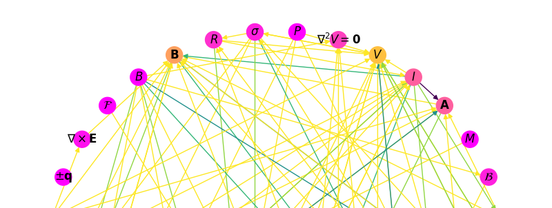

<!-- Banner Image -->

# tex-2-graph
Reduce problem solving to path-tracing along a directed knowledge graph (given a .tex of equations grouped by input/output)

### Motivation
- Many problems can be reduced to a series of mappings from one quantity to another
- A problem is "hard" when the proper mapping (or series of mappings) is unintuitive
- A good review sheet will clearly elucidate **all possible mappings** between **all quantities**

### Solution
- Given a list of equations grouped by quantities involved, construct a **directed knowledge graph** where
  1. vertices are quantities
  2. edges are (typically one-way) mappings, weighted by conditions for use
- "Solving a problem" becomes tracing a path from one quantity to another

### Errata
- See issues for further deliberation
